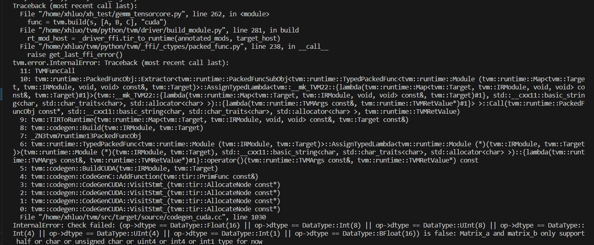
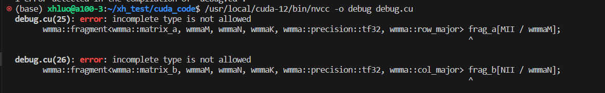

1. 精度问题，我把所有的float16变为float32之后，报了bug：Matrix_a and matrix_b only support half or char or unsigned char or uint4 or int4 or int1 type for now。
不支持float32？

2. size问题，换了有些size会产生参数不匹配的问题，也许需要改wrap tile和thread block Tile

3. 声明bug：

